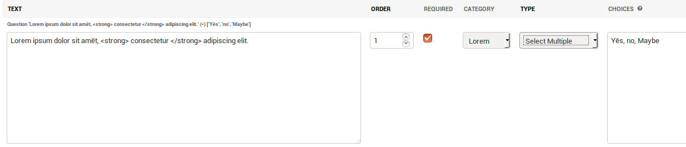
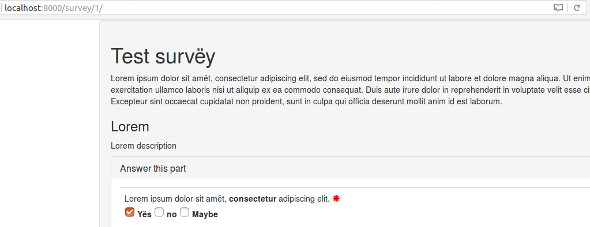
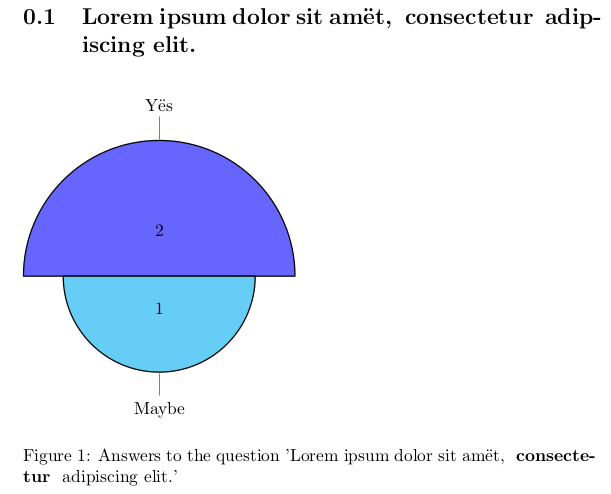
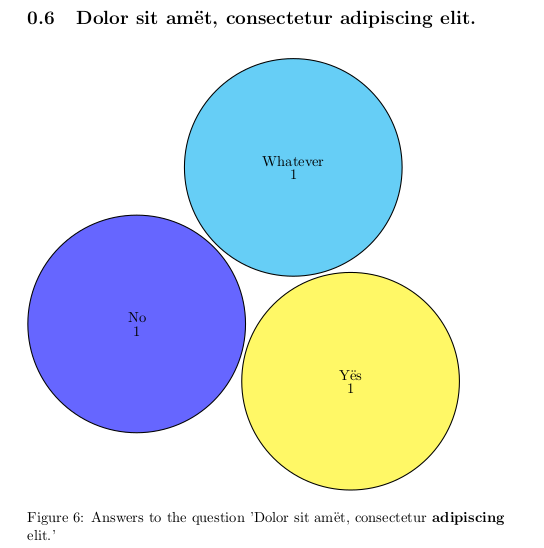
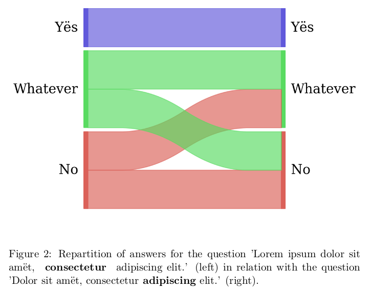
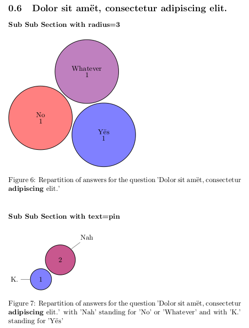
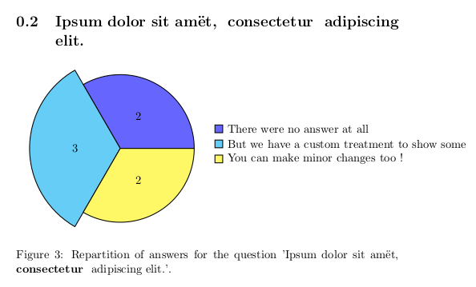

# Django survey

A django survey app, based on and compatible with "django-survey".
You will be able to migrate your data from an ancient version of
django-survey, but it has been ported to python 3 and you can export results as
CSV or PDF using your native language.

The latest version still compatible with python 2.7 is 1.2.1.

# Summary

[Getting started](https://github.com/Pierre-Sassoulas/django-survey#getting-started)

[Making a survey](https://github.com/Pierre-Sassoulas/django-survey#making-a-survey)

[Generating a pdf report from the survey's result](https://github.com/Pierre-Sassoulas/django-survey#generating-a-pdf-report-from-the-surveys-result)
  - [Basic example](https://github.com/Pierre-Sassoulas/django-survey#basic-example)
  - [Sankey's diagram](https://github.com/Pierre-Sassoulas/django-survey#sankey-diagram)
  - [Advanced example](https://github.com/Pierre-Sassoulas/django-survey#advanced-example)
  - [Implementing a custom treatment](https://github.com/Pierre-Sassoulas/django-survey#implementing-a-custom-treatment)

[Contributing as a developper](https://github.com/Pierre-Sassoulas/django-survey#contributing-as-a-developper)
  - [Development environement](https://github.com/Pierre-Sassoulas/django-survey#development-environement)
  - [Test](https://github.com/Pierre-Sassoulas/django-survey#test)
  - [Coverage](https://github.com/Pierre-Sassoulas/django-survey#coverage)
  - [Sorting imports](https://github.com/Pierre-Sassoulas/django-survey#sorting-imports)
  - [Lint](https://github.com/Pierre-Sassoulas/django-survey#lint-)

[Translating the project](https://github.com/Pierre-Sassoulas/django-survey#translating-the-project)
  - [Language available](https://github.com/Pierre-Sassoulas/django-survey#language-available)
  - [As a developper](https://github.com/Pierre-Sassoulas/django-survey#as-a-developper)
  - [As a translator](https://github.com/Pierre-Sassoulas/django-survey#as-a-translator)

[Credit](https://github.com/Pierre-Sassoulas/django-survey#credits)

# Getting started

Add `django-survey-and-report` to your requirements and get it with pip.

	echo 'django-survey-and-report' > requirements.txt
	pip install -r requirements.txt

Add `bootstrapform` and `survey` in the `INSTALLED_APPS` in your settings :

	INSTALLED_APPS = [
		...
		'bootstrapform',
		'survey'
	]

Add an URL entry to your project’s urls.py, for example:

    from django.conf import settings

    if 'survey' in settings.INSTALLED_APPS:
        urlpatterns += [
            url(r'^survey/', include('survey.urls'))
        ]

Note: you can use whatever you wish as the URL prefix.

To uninstall `django-survey-and-report`, simply comment out or remove the
'survey' line in your `INSTALLED_APPS`.

If you want to use the pdf rendering with the Sankey's diagram generation
you will have to install python-tk (for python 2.7) or python3-tk (for python 3.x).

# Making a survey

Using the admin interface you can create surveys, add questions, give questions
categories, and mark them as required or not. You can define choices for answers
using comma separated words.

The front-end survey view then automatically populates based on the questions
that have been defined and published in the admin interface. We use bootstrap3
to render them.

Submitted responses can be viewed via the admin backend, in an exported csv
or in a pdf generated with latex.

# Generating a pdf report from the survey's result

You can manage the way the report is created in a yaml file, globally, survey
by survey, or question by question. In order to render pdf you will need to
install texlive and python-tk or python3-tk for sankey's diagram.

The results are generated for the server only when needed, but you can force
it as a developper with:

~~~~
python manage.py exportresult -h
~~~~

Following is an example of a configuration file. you can generate one with:

~~~~
python manage.py generatetexconf -h
~~~~

## Basic example

~~~~
generic:
    document_option: 11pt

Test survëy:
    document_class: report
    questions:
  Lorem ipsum dolor sit amët, <strong> consectetur </strong> adipiscing elit.:
      chart:
          type: polar
          text: pin
  Dolor sit amët, consectetur<strong>  adipiscing</strong>  elit.:
      chart:
          type: cloud
          text: inside
~~~~

The pdf is then generated using the very good pgf-pie library.

## Sankey diagram

If you installed python3-tk, you can also show the relation between two
questions using a sankey diagram :

~~~~
Lorem ipsum dolor sit amët, <strong> consectetur </strong> adipiscing elit.:
    chart:
      type: sankey
      question: Dolor sit amët, consectetur<strong>  adipiscing</strong>  elit.
~~~~

You get this as a result:

## Advanced example

You can also limit the answers shown by cardinality, filter them, group them
together and choose the color for each answer or group of answers.

If you use this configuration for the previous question:
~~~~
Test survëy:
  Dolor sit amët, consectetur<strong>  adipiscing</strong>  elit.:
    multiple_charts:
      Sub Sub Section with radius=3 :
        color: {"Yës": "blue!50", "No": "red!50",
                "Whatever": "red!50!blue!50"}
        radius: 3
      Sub Sub Section with text=pin :
        group_together: {"Nah": ["No", "Whatever"], "K.": ["Yës"]}
        color: {"Nah": "blue!33!red!66", "K.": "blue!50"}
        text: pin
    chart:
      radius: 1
      type: cloud
      text: inside
~~~~

You get this as a result:

## Implementing a custom treatment

If you want to make your own treatment you can use your own class, for example.

Configuration:
~~~~
Test survëy:
    questions:
        Ipsum dolor sit amët, <strong> consectetur </strong>  adipiscing elit.:
            chart:
                type: survey.tests.exporter.tex.CustomQuestion2TexChild
~~~~

Code in `survey.tests.exporter.tex.CustomQuestion2TexChild`:

~~~~
from survey.exporter.tex.question2tex_chart import Question2TexChart

class CustomQuestion2TexChild(Question2TexChart):

    def get_results(self):
        self.type = "polar"
        return """        2/There were no answer at all,
        3/But we have a custom treatment to show some,
        2/You can make minor changes too !"""
~~~~

Result:

For a full example of a configuration file look at `example_conf.yaml` in doc,
you can also generate your configuration file with
`python manage.py generatetexconf -h`, it will create the default skeleton
for every survey and question.

# Contributing as a developper

## Development environement

You may want to use a virtualenv :

~~~~
  python3 -m venv .env/
  source .env/bin/activate
~~~~

In order to get started, install the dev requirements, create the database,
create a superuser, load the test dump, then launch the server :

~~~~
  pip install -r requirements_dev.txt
  python manage.py migrate
  python manage.py createsuperuser
  python manage.py loaddata survey/tests/testdump.json
  python manage.py runserver
~~~~

## Test

~~~~
  python manage.py test survey
~~~~

## Coverage

~~~~
  coverage.sh
  xdg-open htmlcov/index.html
~~~~

## Sorting imports

~~~~
    isort -rc survey
~~~~

## Lint :

~~~~
  pylint survey
~~~~

# Translating the project

Django survey's is available in multiple language.
Your contribution would be very appreciated if you
know a language that is not yet available.

## Language available

- [x] French thanks to Pierre Sassoulas (@Pierre-Sassoulas)
- [x] English
- [x] Japanese thanks to Nobukuni Suzue (@nsuzue)

## As a developper

If your language already exists and you're a developper :

~~~~
  python manage.py makemessages --no-obsolete --no-wrap
  python manage.py runserver
  # Access http://localhost:8000/rosetta
~~~~

If your language is not yet available in rosetta,
[this stack overflow question](https://stackoverflow.com/questions/12946830/how-to-add-new-languages-into-django)
should work even for language not handled by django.

## As a translator

If you're not a developper, open an issue on github and ask for a .po
file in your language. I will generate it for you, so you can edit it with an online editor.
I will then integrate it to the project and credit you
[here](https://github.com/Pierre-Sassoulas/django-survey#language-available).

# Credits

Based on [jessykate's django-survey](https://github.com/jessykate/django-survey),
and contribution by jibaku, joshualoving, and ijasperyang in forks of jessykate's project.

We use [anazalea's pySankey](https://github.com/anazalea/pySankey) for sankey's
diagram during reporting.
